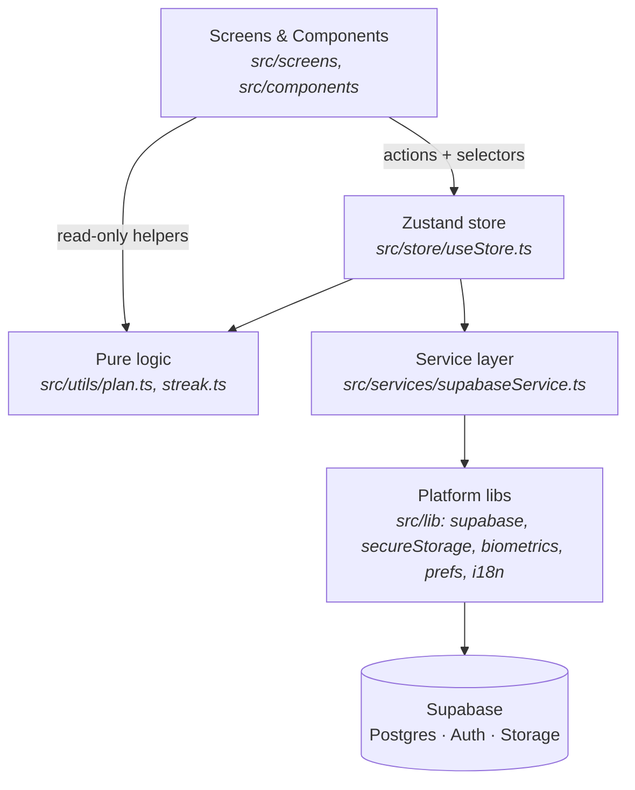
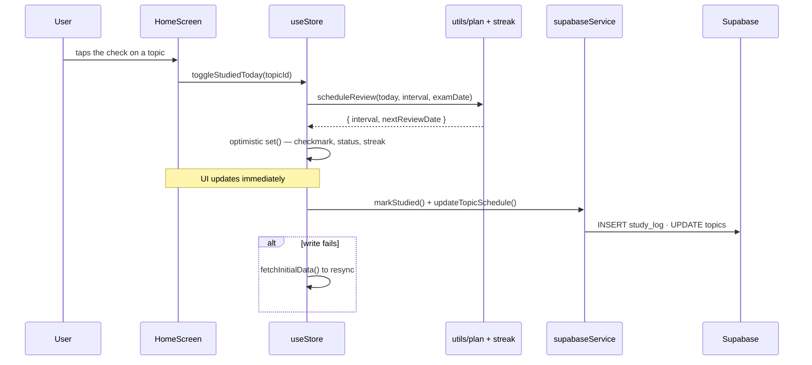
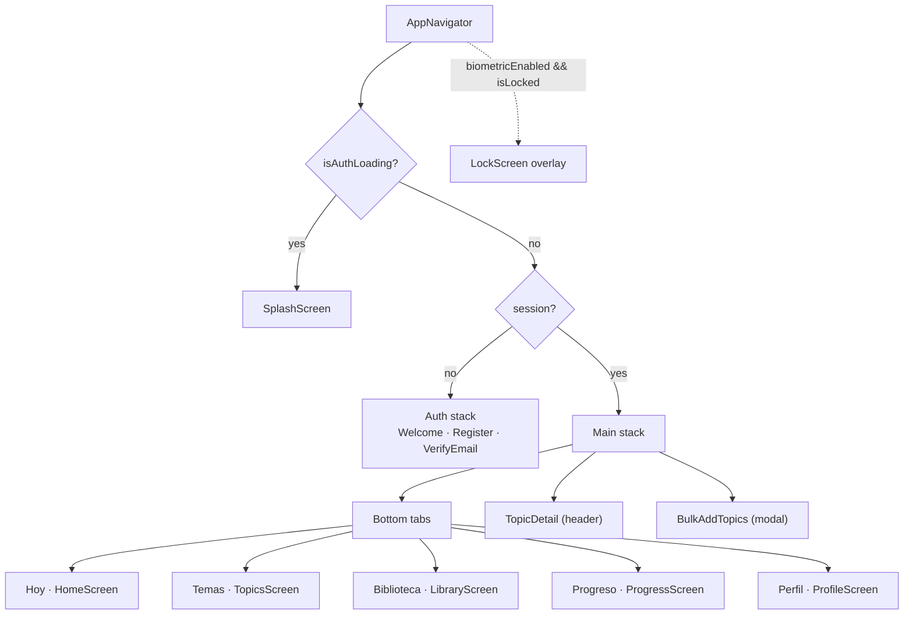

# Architecture

How Studiq is put together and **why**. Read this first if you are new to the codebase — 20 minutes here saves hours later.

---

## 1. Guiding principles

| Principle | Consequence in code |
|---|---|
| **One data path** | Screens → store → service → Supabase. A screen that imports `supabase` directly is a bug. |
| **Derive, don't store** | The daily plan is computed from `topics` + exam date on every render. There is no `study_plan` table (it existed once and was dropped in migration `0003`). |
| **Pure logic is testable logic** | Scheduling and streak maths live in `src/utils/` as pure functions with `.test.ts` self-checks. |
| **The server is the security boundary** | RLS enforces isolation. Client-side `user_id` filters are for correctness and index usage, never for security. |
| **Device-local state stays local** | Language, active exam and the biometric-lock flag live in SecureStore, not in the database — they are per-device choices. |

---

## 2. Layers



### `src/screens` — presentation
One file per screen. Screens read state with **per-field selectors** and call store actions. They own only ephemeral UI state (form drafts, modal visibility, upload progress).

### `src/store/useStore.ts` — orchestration
A single Zustand store. Actions coordinate: optimistic state update → service call → reconcile (or reload on failure). Also the home for `topicProgress()`, the one place mastered-count/percentage is computed.

### `src/utils` — pure domain logic
No React, no I/O. This is where the product actually lives:
- `plan.ts` — `buildDailyPlan`, `scheduleReview`, `nextReviewInterval`, `daysUntil`
- `streak.ts` — `computeStreak`, `todayISO`, `addDaysISO`

### `src/services/supabaseService.ts` — data access
The **only** module that touches Supabase tables/storage. Every method returns plain domain types.

### `src/lib` — platform adapters
`supabase.ts` (client + AppState auto-refresh), `secureStorage.ts` (chunked keychain adapter), `biometrics.ts`, `prefs.ts`, `i18n.ts`.

---

## 3. Data flow: marking a topic studied

The most instructive path in the app — optimistic UI, pure logic and persistence in one action.



Why optimistic: this is the single most-repeated interaction. Waiting on two round-trips made the checkmark feel broken. The streak is recomputed **locally** from `studyDates` held in the store, which removed a third network call per tap.

---

## 4. The planning engine

`buildDailyPlan(topics, studiedTodayIds, examDate, today)` returns today's list:

1. **New quota** = `max(1, ceil(notStarted / daysUntilExam))`, or `3/day` when no exam date is set.
2. **New picks** — topics already introduced today count against the quota, so checking one off doesn't pull another in.
3. **Due reviews** — anything past its first pass whose `next_review_date <= today`. Mastered topics are included, so they resurface for a light final review.
4. **Pinning** — anything studied today stays visible (checked) instead of vanishing.

`scheduleReview` expands the interval `2 → 4 → 8 → 16 → 21` (capped) and **clamps the date to the exam day**, so a final pass always lands on or before the exam. Once the exam is today or past, no further review is scheduled.

All of it is covered by `src/utils/plan.test.ts` (quota, pacing, done-counts-against-quota, due/not-due, mastered resurfacing, exam clamping).

---

## 5. Navigation



The auth gate is **structural**: the two stacks are mutually exclusive branches of the same navigator, so there is no way to reach an authenticated screen without a session — no route guards to forget.

The `LockScreen` is rendered as a **sibling overlay** of the `NavigationContainer`, not a route. It therefore covers whatever is on screen without touching navigation state.

> **Route names are Spanish** (`Hoy`, `Temas`, `Biblioteca`, `Progreso`, `Perfil`) for historical reasons. They are identifiers, never shown to users — visible labels come from i18n. Renaming them is a safe cleanup task.

---

## 6. State management

One Zustand store, no middleware, no persistence layer. Slices:

| Slice | Contents |
|---|---|
| Auth | `session`, `isAuthLoading` |
| Data | `subjects`, `activeSubjectId`, `topics`, `materials`, `studiedTodayIds`, `studyDates`, `profile`, `progress` |
| UI/device | `language`, `biometricEnabled`, `isLocked`, `lockSuppressed`, `isLoading` |

**Selector discipline.** Components subscribe per field:

```ts
const topics = useStore(state => state.topics);          // ✅ re-renders on topics only
const { topics, profile } = useStore();                   // ❌ re-renders on every change
```

**Why no `persist` middleware?** Only three values need to survive a restart (language, active exam, biometric flag) and they belong in the encrypted keychain, not in plain storage. `src/lib/prefs.ts` handles them explicitly — less magic, and no risk of accidentally persisting a session token to unencrypted storage.

---

## 7. Supabase integration

- **Client** (`src/lib/supabase.ts`) — `storage: secureStorage`, `autoRefreshToken`, `persistSession`, `detectSessionInUrl: false`. An `AppState` listener starts/stops the refresh timer, which React Native requires for refresh to be reliable.
- **Identity** — the service reads the user id from `getSession()` (local) rather than `getUser()` (network round-trip). RLS enforces access server-side, so the local id is only used to scope queries and populate `user_id` on inserts.
- **Storage** — files live at `{uid}/{materialId}/{filename}` in the private `materials` bucket. The storage policy checks that the first path segment equals `auth.uid()`. Reads use one-hour **signed URLs**, handed to the OS viewer via `Linking.openURL`.

See [DATABASE.md](DATABASE.md) and [API.md](API.md).

---

## 8. Internationalization

`src/lib/i18n.ts` initialises synchronously at import time with both locale trees bundled — no async loading, so the first paint is already translated. Six namespaces keep keys scoped. `expo-localization` picks the initial language; `setLanguage` persists the user's choice.

**Rule:** every user-visible string comes from a namespace, and `es`/`en` are kept key-for-key aligned. A missing key silently falls back to English, which is easy to miss — the parity check in [TESTING.md](TESTING.md) exists for exactly this.

---

## 9. Component design

`src/constants/theme.ts` is the **single source** for colour, typography, spacing, radii and shadows. Components compose from it; raw hex values in a screen are a smell.

Components are deliberately few and dumb: `Button`, `Card`, `ListItem`, `DatePickerModal`, `ExamManagerModal`, `ErrorBoundary`. Anything used by exactly one screen stays in that screen until a second caller appears.

`ErrorBoundary` wraps the whole navigator so a render crash shows a readable message instead of a blank screen.

---

## 10. Scalability

**Holds well:** the schema (FKs, indexes, RLS), the derived plan (no scheduler to migrate), the pure-logic core, the service boundary.

**Known ceilings, and when they'd bite:**

| Ceiling | Bites when | Upgrade path |
|---|---|---|
| No pagination — all topics/materials load at once | thousands of rows per user | `range()` + infinite lists |
| Single monolithic store | the store file becomes hard to navigate | split into slices |
| Uploads buffer whole files in memory | very large PPT/video files | streamed/resumable upload |
| Review interval capped at a fixed 21 days | you want true SM-2 grading | use the reserved `ease_factor` column |
| No offline cache | you study on the metro | local persistence + sync queue |

None are urgent for the current single-user, few-hundred-row workload; they are documented so the next person knows the shape of the wall before hitting it.
