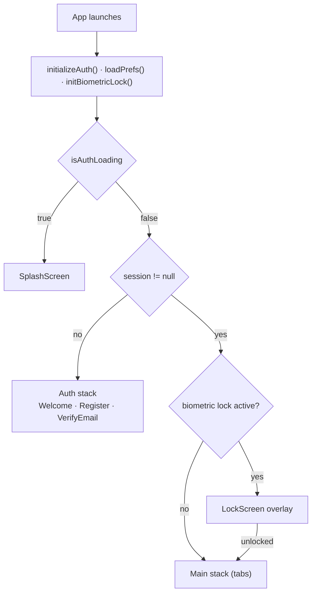
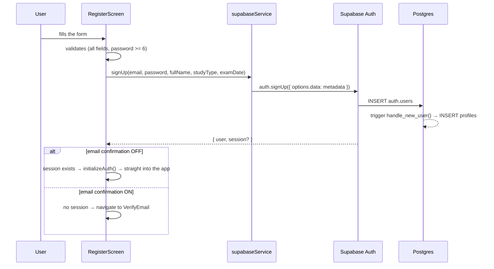
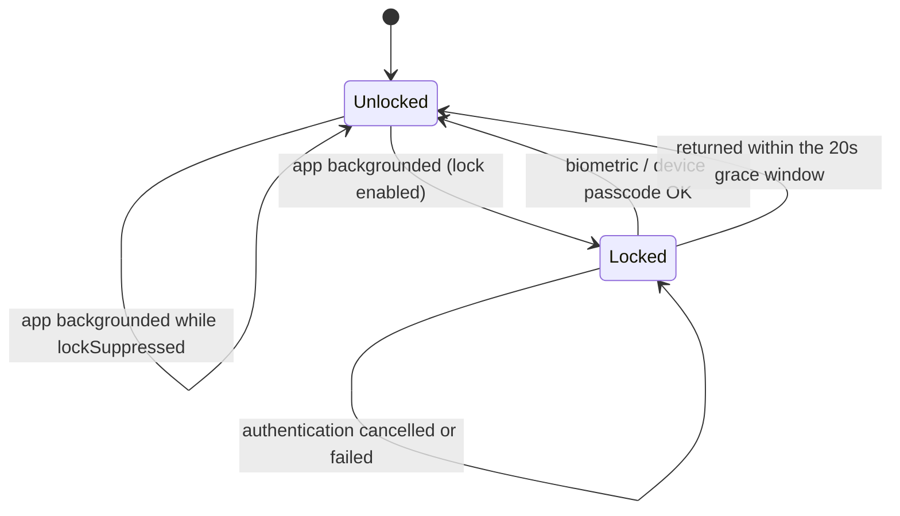

# Authentication

Supabase Auth with email + password. This document covers every flow, where the session lives, and why biometrics work the way they do.

**Files involved:** `src/lib/supabase.ts`, `src/lib/secureStorage.ts`, `src/lib/biometrics.ts`, `src/services/supabaseService.ts`, `src/store/useStore.ts`, `src/navigation/AppNavigator.tsx`, `src/screens/auth/*`, `src/screens/LockScreen.tsx`.

---

## 1. The auth gate

There are no route guards. The navigator renders **one of two mutually exclusive stacks**:



Because the stacks are structural, an authenticated screen is unreachable without a session — there is no guard to forget on a new screen.

---

## 2. Registration

`RegisterScreen` collects name, email, password, study type and exam date.



Two things worth knowing:

**The screen adapts to your Supabase setting.** If `signUp` returns a session (confirmation disabled) the user goes straight in; otherwise they land on `VerifyEmail`. You can flip *Authentication → Providers → Email → Confirm email* in Supabase **without touching code**.

**`study_type` and `exam_date` are stored as user metadata, not as a row.** The first subject cannot be inserted during `signUp` because there is no active session yet and RLS would reject it. Instead `createInitialSubjectIfNeeded()` runs on the first authenticated data fetch and creates it from that metadata. `addTopics` has a second safety net: if there is still no subject, it creates one on the fly.

---

## 3. Login and logout

```ts
// src/services/supabaseService.ts
await supabase.auth.signInWithPassword({ email: email.trim().toLowerCase(), password });
```

Email is normalised (`trim().toLowerCase()`) in `signIn`, `signUp` and `resetPassword` — a trailing space from autocomplete used to cause confusing failures.

Logout calls `supabase.auth.signOut()` then `setSession(null)`; the navigator swaps stacks on the next render.

---

## 4. Email verification

`VerifyEmailScreen` (only reachable when confirmation is enabled):

- **Polls** `getUser()` every 4s and enters the app as soon as `email_confirmed_at` is set.
- **"I've verified it"** forces `refreshSession()`.
- **Resend** with a 60-second cooldown.

This polling design means **no deep link is required** — the user taps the link in their mail client, comes back, and the app has already noticed.

---

## 5. Password: reset and change

Two different flows, deliberately:

| Situation | Mechanism | Where |
|---|---|---|
| **Logged out**, forgot password | `resetPasswordForEmail()` → email link | `WelcomeScreen` → "Forgot password?" |
| **Logged in**, wants to change it | `updateUser({ password })` — direct, no email | `ProfileScreen` → Security |

The in-app change is the better UX and has no email dependency at all. It requires two Supabase settings to stay **off** (both are off by default):

- *Secure password change* — would require a login in the last 24h
- *Require current password when updating* — the app doesn't collect it

The logged-out reset deliberately shows the **same confirmation whether or not the account exists**, so the screen can't be used to probe which emails are registered.

> ⚠️ Completing the reset from the email link needs a deep link + a "set new password" screen, which are **not implemented**. The link currently opens whatever your Supabase *Site URL* points at. Tracked in [TODO.md](../TODO.md).

---

## 6. Session persistence

The session is stored **encrypted in the device keychain**, not in AsyncStorage.

```ts
// src/lib/supabase.ts
createClient(url, anonKey, {
  auth: {
    storage: secureStorage,      // expo-secure-store, chunked
    autoRefreshToken: true,
    persistSession: true,
    detectSessionInUrl: false,   // no URL-based flows on native
  },
});
```

### Why `secureStorage` is chunked

SecureStore caps a value at **2048 bytes**, and a Supabase session (JWT + user metadata) can exceed that. `src/lib/secureStorage.ts` splits the value across numbered keys (`key.0`, `key.1`, …).

The chunk size counts **characters at a worst-case 4 bytes each**, because the cap is on bytes and session JSON keeps non-ASCII literal — an accented name like `Sánchez` is 2 bytes per accent. Splitting by character count alone silently exceeded the cap and broke session persistence for exactly those users. Surrogate pairs are never split.

`src/lib/secureStorage.test.ts` covers empty values, exact chunk multiples, multi-byte throughout, emoji on a boundary, and orphan cleanup when a value shrinks.

---

## 7. Token refresh and expiry

Two mechanisms, both required on React Native:

**Refresh timer tied to app lifecycle** — supabase-js only refreshes reliably while a timer runs, and that timer must pause in the background:

```ts
// src/lib/supabase.ts
AppState.addEventListener('change', state => {
  if (state === 'active') supabase.auth.startAutoRefresh();
  else supabase.auth.stopAutoRefresh();
});
```

**Reactive session changes** — `AppNavigator` subscribes to `onAuthStateChange` and pushes every session into the store. This catches `SIGNED_OUT`, `TOKEN_REFRESHED` and, critically, **refresh failure**: without it a user whose refresh token expired would sit on authenticated screens watching every query fail, with no way back to login.

---

## 8. Biometrics — an app lock, not a login

**Biometrics never authenticate you against Supabase.** They gate access to a session that already exists and is already encrypted at rest.

> **History worth knowing:** an earlier implementation stored the user's **plaintext password** in SecureStore to replay it on biometric login, and never actually saved it — so the button failed 100% of the time. It was removed entirely and rebuilt as a lock. If you ever re-add "biometric login", gate the **session/refresh token**, never a password.



Behaviour:

- **Enabling requires passing the check first** (`enableBiometric`), so nobody can enable a lock they can't get through. If no biometric is enrolled, the switch refuses with an explanation.
- **Device passcode fallback** stays on (`disableDeviceFallback: false`) so a wiped fingerprint doesn't lock you out of your own account.
- **20-second grace window** — a quick app switch doesn't re-prompt.
- **`lockSuppressed`** — when *the app itself* opens a file in the OS viewer, the resulting background trip doesn't trigger the lock. Without it, reading a PDF meant re-authenticating on every return.
- The preference lives in **SecureStore** (`biometric_lock_enabled`), not in the database: "unlock with Face ID" is a per-device choice.

---

## 9. Account deletion

Required by App Store guideline 5.1.1(v) and Google Play.

```ts
await supabase.rpc('delete_current_user');  // SECURITY DEFINER, deletes auth.users WHERE id = auth.uid()
await supabase.auth.signOut();
```

The FK cascade removes profile, subjects, topics, notes, study log and materials rows. Storage objects in the `materials` bucket are **not** removed by the cascade — a known gap noted in [TODO.md](../TODO.md).

The UI (Profile → bottom) requires an explicit destructive confirmation, then wipes in-memory state so nothing stale flashes while routing back to the auth stack.

---

## 10. Security summary

| Concern | Handling |
|---|---|
| Session at rest | Encrypted keychain via SecureStore, chunked |
| Passwords at rest | **Never stored.** Not on device, not in the app |
| Token refresh | `autoRefreshToken` + AppState timer |
| Expiry / revocation | `onAuthStateChange` → back to login |
| Cross-user access | RLS `auth.uid() = user_id` on every table |
| Account enumeration | Password-reset confirmation is identical either way |
| Password strength | Client-side min 6, matching Supabase's minimum |
| Anonymous sign-in | **Disabled** in the Supabase dashboard |

See [SECURITY.md](SECURITY.md) for the full posture.
