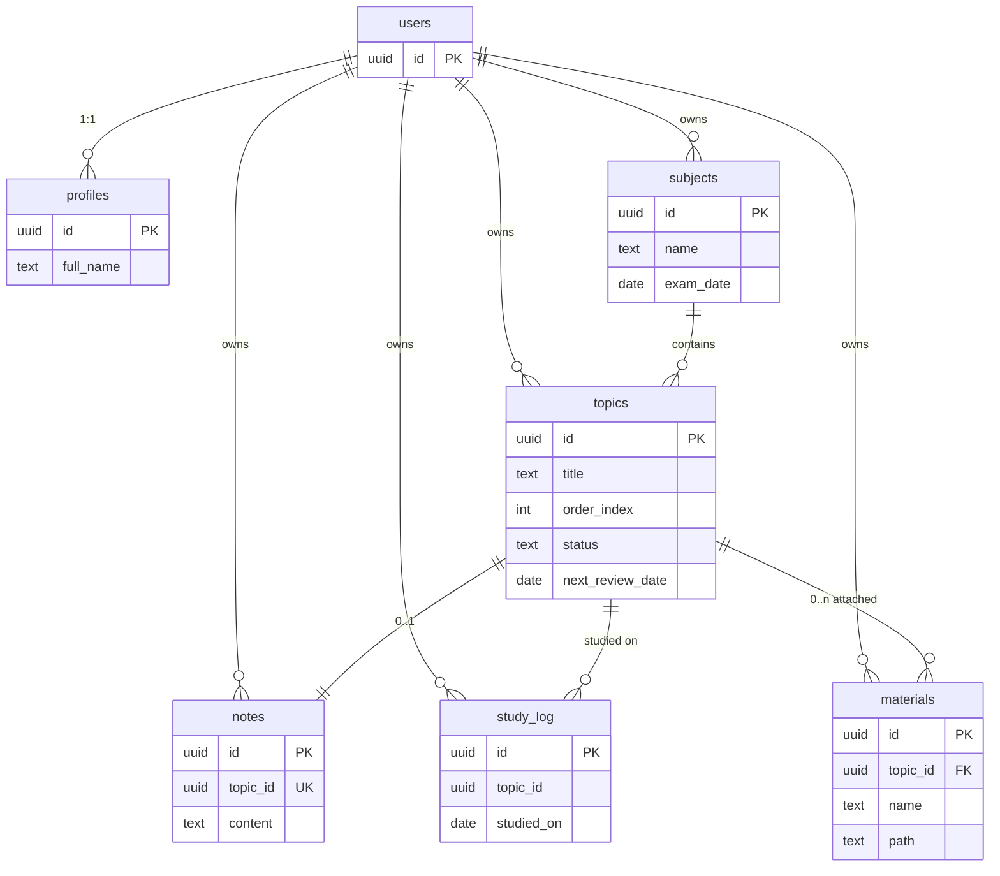

# Database

PostgreSQL on Supabase. Six active tables, all isolated by row-level security, plus one private storage bucket.

Migrations live in `supabase/migrations/` and are applied **by hand in the Supabase SQL editor** — this repository has no Supabase CLI setup.

---

## 1. Schema overview



`users` is Supabase's built-in `auth.users`. **Every** table references it with `ON DELETE CASCADE`, which is what makes in-app account deletion work in a single statement.

---

## 2. Tables

### `profiles`
Public profile data, created automatically on signup.

| Column | Type | Notes |
|---|---|---|
| `id` | `uuid` PK | FK → `auth.users(id)` CASCADE |
| `full_name` | `text` | From signup metadata |
| `avatar_url` | `text` | Reserved, unused |
| `created_at` / `updated_at` | `timestamptz` | `updated_at` maintained by trigger |

> A `biometric_enabled` column exists in older projects. It is unused — the biometric flag is per-device and lives in SecureStore. Migration `0003` drops it.

### `subjects` — "exams"
The user-facing concept is an **exam**; the table is called `subjects` for historical reasons.

| Column | Type | Notes |
|---|---|---|
| `id` | `uuid` PK | |
| `user_id` | `uuid` | FK → `auth.users` CASCADE |
| `name` | `text NOT NULL` | e.g. "Oposición Hacienda" |
| `exam_date` | `date NULL` | **Nullable** — the planner falls back to 3 new topics/day |
| `created_at` | `timestamptz` | |

Deleting a subject cascades its topics (and their notes and study log). Its materials survive: they fall back to the library.

### `topics`
The syllabus. Drives the whole planner.

| Column | Type | Notes |
|---|---|---|
| `id` | `uuid` PK | |
| `user_id`, `subject_id` | `uuid` | Both CASCADE |
| `title` | `text NOT NULL` | |
| `description` | `text` | Reserved, unused in UI |
| `order_index` | `int DEFAULT 0` | Syllabus order; new topics append after the max |
| `status` | `text` | `CHECK IN ('not_started','in_progress','mastered')` |
| `pdf_url` | `text` | **Legacy.** Superseded by `materials`; still present but unread |
| `last_review_date` | `date` | Set on each study event |
| `next_review_date` | `date` | When it returns to the plan |
| `review_interval` | `int DEFAULT 1` | Days; expands 2→4→8→16, capped 21 |
| `ease_factor` | `real DEFAULT 2.5` | **Reserved** for future SM-2 grading; unused |

> `order_index` is named that way because `order` is a reserved SQL keyword that would need quoting forever.

### `notes`
One free-text note per topic.

| Column | Type | Notes |
|---|---|---|
| `topic_id` | `uuid` **UNIQUE** | CASCADE — the uniqueness is what makes upsert work |
| `content` | `text` | |
| `updated_at` | `timestamptz` | Maintained by trigger |

⚠️ Because the uniqueness is on `topic_id` (not the PK), `saveNote` **must** pass `onConflict: 'topic_id'`. Without it, upsert resolves against the primary key, generates a fresh `id`, and trips the unique constraint on the second save.

### `study_log`
One row per topic per day studied. Powers today's checkmarks and the streak.

| Column | Type | Notes |
|---|---|---|
| `topic_id`, `studied_on` | | **`UNIQUE (topic_id, studied_on)`** |
| `studied_on` | `date` | The **client's local date**, not UTC |

Two deliberate decisions:
- The unique constraint makes marking idempotent — re-marking the same topic the same day is a no-op (`ignoreDuplicates: true`).
- The client sends its own local date because a streak must break at the user's midnight, not UTC's.

### `materials`
Study files. One file belongs to at most one topic; a topic can hold many.

| Column | Type | Notes |
|---|---|---|
| `topic_id` | `uuid NULL` | **`ON DELETE SET NULL`** — deleting a topic returns its files to the library instead of destroying them |
| `name` | `text NOT NULL` | Original filename |
| `path` | `text NOT NULL` | Storage key `{uid}/{materialId}/{filename}` |
| `mime_type` | `text` | From the document picker |

### Legacy tables

`study_plan` and `study_sessions` exist in older projects and are **never read or written** by the app. `study_plan` was replaced by the derived daily plan. Migration `0003` drops both (optional, destructive).

---

## 3. Row-level security

**Every table has RLS enabled** with one permissive `FOR ALL` policy:

```sql
using (auth.uid() = user_id) with check (auth.uid() = user_id)
```

(`profiles` uses `auth.uid() = id`.)

Both `USING` (read/update/delete) and `WITH CHECK` (insert/update) are set, so a user can neither read another user's rows nor write rows attributed to someone else. `auth.uid()` is `NULL` for anonymous callers, so logged-out access returns nothing.

> **This is the security boundary.** Client-side `.eq('user_id', …)` filters exist for correctness and index usage — never rely on them for isolation.

### Storage policies

The private `materials` bucket has SELECT / INSERT / DELETE policies asserting:

```sql
bucket_id = 'materials' AND (storage.foldername(name))[1] = auth.uid()::text
```

Hence the `{uid}/…` path prefix: the first segment **is** the authorization check. Everything after it is key hygiene only.

---

## 4. Indexes

| Index | Table | Why |
|---|---|---|
| `*_pkey` | all | Primary keys |
| `notes_topic_id_key` | `notes` | Unique — enables note upsert |
| `topics_subject_id_order_idx` | `topics` | `(subject_id, order_index)` — the syllabus list query |
| `topics_user_id_idx` | `topics` | RLS predicate |
| `subjects_user_id_idx` | `subjects` | RLS predicate |
| `notes_user_id_idx` | `notes` | RLS predicate |
| `materials_user_idx` / `materials_topic_idx` | `materials` | Library list and per-topic filter |
| `study_log_user_date_idx` | `study_log` | `(user_id, studied_on DESC)` — streak query |

Before migration `0002` only the primary keys were indexed, so every RLS check was a sequential scan.

---

## 5. Triggers and functions

| Object | Purpose |
|---|---|
| `handle_new_user()` + `on_auth_user_created` | `AFTER INSERT ON auth.users` → creates the `profiles` row from signup metadata. `SECURITY DEFINER` with `search_path = ''` pinned (migration `0002`) to avoid the mutable-search-path hijack Supabase's linter flags. |
| `update_modified_column()` | `BEFORE UPDATE` on `profiles` and `notes` → maintains `updated_at`. The client must **not** set it manually. |
| `delete_current_user()` | RPC. `SECURITY DEFINER`, deletes `auth.users WHERE id = auth.uid()`; the FK cascade removes all user data. Execute granted to `authenticated` only. Required for App Store compliance. |

> `on_auth_user_created` lives on `auth.users`, outside the `public` schema — it will **not** show up in a `public`-scoped introspection dump. It is recreated in `0001`; without it, new signups get no profile row.

---

## 6. Migrations

Applied in order via the Supabase SQL editor.

| File | What it does | Required? |
|---|---|---|
| `0001_baseline.sql` | The schema as it existed before migrations were tracked. Idempotent; a no-op on a live DB. Rebuilds everything from scratch. | Only for a fresh project |
| `0002_indexes_search_path_study_log.sql` | Pins `handle_new_user` search_path, adds the missing indexes, creates `study_log`. | **Yes** |
| `0003_drop_unused_optional.sql` | Drops `study_plan`, `study_sessions`, `profiles.biometric_enabled`. **Destructive.** | Optional |
| `0004_materials.sql` | Creates `materials` + RLS + indexes, backfills from `topics.pdf_url`. | **Yes** |
| `0005_delete_account.sql` | Creates the `delete_current_user()` RPC. | **Yes** (store requirement) |

### Fresh project

Run `0001` → `0002` → `0004` → `0005`. Then create a **private** storage bucket named `materials` and add the three policies from §3.

### Verifying a live schema

`supabase/introspect.sql` dumps columns, constraints, indexes, RLS status, policies, triggers, functions and buckets as a single JSON cell — useful before writing any migration.

---

## 7. Conventions

- **UUID primary keys** via `gen_random_uuid()`.
- **`timestamptz`** everywhere, defaulting to `timezone('utc', now())`. The one exception is `study_log.studied_on`, a plain `date` supplied by the client in local time (see §2).
- **Cascade from `auth.users`** on every table — this is what makes account deletion a one-liner.
- **`CHECK` constraints mirror TypeScript unions.** `topics.status` and the `TopicStatus` type must be changed together.
- **New migrations are additive and numbered.** Never edit an applied migration; add the next number.
- **Nullable means "handle it".** `subjects.exam_date` and `materials.topic_id` are nullable by design and the UI has explicit paths for both.
